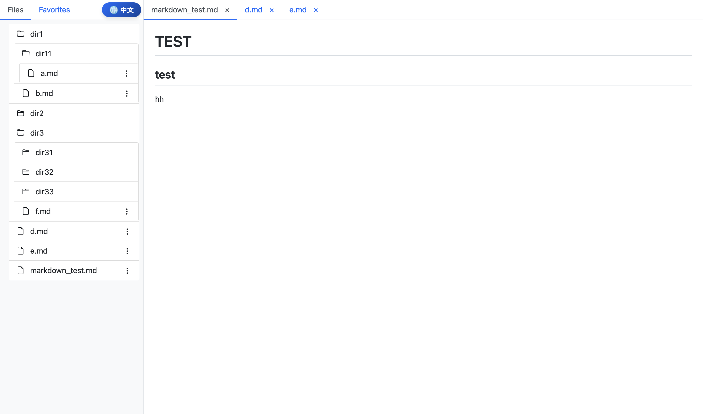

# 轻量级 Markdown 预览服务器

## 简介
en [English](README.md)

这是一个基于 Flask 的简单 Markdown 预览服务器，允许你浏览目录并以类似 GitHub 的风格预览 Markdown 文件。

## 功能
- **文件浏览器：** 浏览目录并显示 Markdown 文件。
- **实时 Markdown 预览：** 实时渲染 Markdown 内容。
- **标签管理：** 打开、关闭和切换多个 Markdown 文件。
- **收藏夹：** 轻松保存和访问常用文件。
- **多语言支持：** 同时支持中文和英文。



## 已知问题

1. 在收藏夹面板中切换语言或取消收藏可能会导致文件浏览器中的收藏/取消收藏按钮异常。

## 安装

1. **克隆代码库：**
    ```bash
    git clone https://github.com/loiqy/tiny-markdown-preview-server.git
    ```
2. **进入项目目录：**
    ```bash
    cd tiny-markdown-preview-server
    ```
3. **安装依赖：**
    ```bash
    pip install flask markdown
    ```

## 使用

通过以下命令运行应用：
```bash
python app.py /path/to/your/markdown/files
```
在浏览器中打开 [http://localhost:8900](http://localhost:8900) 开始预览。

## 远程服务器使用技巧

若在远程机器上启动服务器后希望在本地预览，可以使用 SSH 端口转发：

1. 在服务器上启动应用：
    ```bash
    python app.py /path/to/your/markdown/files
    ```
2. 在本地机器上建立 SSH 隧道：
    ```bash
    ssh -L 8900:localhost:8900 your_remote_user@remote_server_ip
    ```
3. 在浏览器中打开 [http://localhost:8900](http://localhost:8900) 查看预览效果。

## 配置

- **基础目录：** 启动应用时传入路径以指定自定义目录。
- **收藏夹：** 由 `userdata/favorites.json` 管理（该目录已从版本控制中排除）。

## 贡献

欢迎贡献代码！如有改进建议，请提交 issue 或 pull request。

## 许可证

该项目遵循 [MIT 许可证](LICENSE) 授权。
